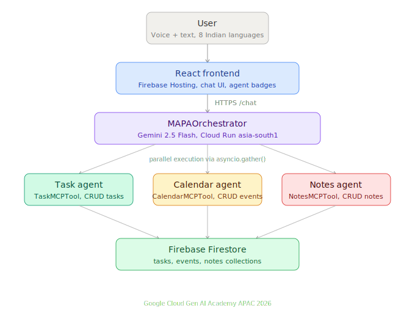

# MAPA — Multi-Agent Productivity Assistant

> **Build in APAC. Build for the world.**
> A multi-agent AI productivity system built for the **Google Cloud Gen AI Academy APAC Hackathon 2026**.

[](https://mapa-api-875352080719.asia-south1.run.app/docs)
[](https://gen-lang-client-0349644995.web.app)
[](https://cloud.google.com/run)
[](https://ai.google.dev)

**🔗 Live Demo:** https://gen-lang-client-0349644995.web.app
**🔗 API Docs:** https://mapa-api-875352080719.asia-south1.run.app/docs

---

## 🎯 The Problem We're Solving

**APAC's productivity tool gap.** Across India and Southeast Asia, millions of students, professionals, and small business owners *think* in their native language — Hindi, Bengali, Tamil, Telugu, Marathi, Gujarati — but are forced to *operate* productivity tools in English. This friction costs time, creates errors, and excludes the non-English-speaking majority from digital productivity.

**MAPA is a voice-first, multilingual, multi-agent assistant** that lets users manage their entire day — tasks, calendar events, and notes — by simply speaking or typing in their own language.

> *"আমাকে কাল বিকেলে dentist-এর কাছে যেতে হবে, আর সন্ধ্যায় groceries কেনার reminder দাও"*
> → MAPA parses this, creates a calendar event + a task, and stores them in Firestore. Instantly.

---

## ✅ Problem Statement Alignment

This project directly addresses every requirement in the Google Cloud Gen AI Academy APAC hackathon problem statement:

> *"Build a multi-agent AI system that helps users manage tasks, schedules, and information by interacting with multiple tools and data sources."*

| Requirement | How MAPA delivers |
|---|---|
| **Primary agent coordinating sub-agents** | `MAPAOrchestrator` (Gemini 2.5 Flash) coordinates three specialized sub-agents: Task, Calendar, Notes |
| **Store/retrieve structured data from a DB** | Firebase Firestore with three collections: `tasks`, `events`, `notes` — full CRUD via agent tools |
| **Integrate multiple tools via MCP** | MCP-style tool abstraction: `TaskMCPTool`, `CalendarMCPTool`, `NotesMCPTool` — all extending a common base |
| **Handle multi-step workflows** | Single user message → LLM intent extraction → multiple parallel tool calls → synthesized response |
| **Deploy as an API-based system** | FastAPI on Google Cloud Run (`asia-south1`), documented via OpenAPI/Swagger UI |

---

## 🏗️ Architecture

```
┌─────────────────────────────────────────────────────────────────┐
│                         USER                                     │
│  (Voice + Text in 8 Indian languages: EN, HI, BN, TA, TE, MR,   │
│                    GU, PA — plus Web Speech API)                │
└────────────────────────────┬────────────────────────────────────┘
                             │
                             ▼
┌─────────────────────────────────────────────────────────────────┐
│              FRONTEND (React + Vite + Firebase Hosting)          │
│  • Chat interface  • Voice input  • Tasks/Calendar/Notes panels │
│  • Browser notifications  • Real-time agent badges              │
└────────────────────────────┬────────────────────────────────────┘
                             │  HTTPS
                             ▼
┌─────────────────────────────────────────────────────────────────┐
│           BACKEND API (FastAPI on Cloud Run asia-south1)         │
│                                                                   │
│   ┌─────────────────────────────────────────────────────┐       │
│   │          PRIMARY AGENT: MAPAOrchestrator             │       │
│   │          (Gemini 2.5 Flash — intent extraction)      │       │
│   └──┬──────────────┬──────────────┬─────────────────────┘       │
│      │              │              │                              │
│      ▼              ▼              ▼                              │
│  ┌────────┐    ┌────────┐    ┌────────┐                          │
│  │ Task   │    │Calendar│    │ Notes  │   ← MCP-style Sub-agents │
│  │ Agent  │    │ Agent  │    │ Agent  │                          │
│  └───┬────┘    └───┬────┘    └───┬────┘                          │
│      │             │             │                                │
└──────┼─────────────┼─────────────┼────────────────────────────────┘
       │             │             │
       ▼             ▼             ▼
┌─────────────────────────────────────────────────────────────────┐
│                  DATA LAYER: Firebase Firestore                  │
│   ┌──────────┐   ┌──────────┐   ┌──────────┐                    │
│   │  tasks   │   │  events  │   │  notes   │                    │
│   └──────────┘   └──────────┘   └──────────┘                    │
└─────────────────────────────────────────────────────────────────┘
```

---

## 🚀 Key Innovations

### 1. **Voice-first, multilingual input for APAC users**
- 8 Indian languages supported out of the box: English, Hindi, Bengali, Tamil, Telugu, Marathi, Gujarati, Punjabi
- Web Speech API integration — users **speak** to the assistant
- Gemini handles mixed-language input (code-switching) naturally

### 2. **Single-shot multi-intent extraction**
- One message from the user → Gemini extracts **all** intended actions at once
- Example: *"Remind me to call mom tomorrow, book a meeting with the team on Friday 3 PM, and save a note about Q2 goals"*
- → Creates 1 task + 1 event + 1 note in a single coordinated run

### 3. **MCP-style extensible tool architecture**
- Every sub-agent implements a common `MCPTool` contract: `name`, `description`, `call(params)`, `ToolResult`
- Adding a new agent (e.g., Email, Reminder, Analytics) takes ~50 lines of code
- Tools are registered in an `MCPRegistry` discoverable via `GET /tools`

### 4. **Real-time conversation memory**
- Session-scoped conversation history (last 20 turns)
- Gemini uses this context to resolve references ("the meeting tomorrow" → the event just created)

### 5. **Production-grade deployment**
- Containerized via Docker → Google Cloud Run (asia-south1, low latency for APAC users)
- Firebase Hosting for frontend → CDN-backed global delivery
- Firebase Admin SDK for Firestore — fully serverless, auto-scaling

---

## 🛠️ Tech Stack

| Layer | Technology |
|---|---|
| **LLM** | Gemini 2.5 Flash (Google AI Studio) |
| **Agent Framework** | Custom MCP-style orchestrator (inspired by Google ADK) |
| **Backend** | Python 3.11, FastAPI, Uvicorn |
| **Database** | Firebase Firestore |
| **Frontend** | React 18, Vite, Firebase Hosting |
| **Voice** | Web Speech API (browser-native) |
| **Deployment** | Google Cloud Run (asia-south1), Cloud Build, Docker |
| **Auth / Admin** | Firebase Admin SDK |

---

## 📊 API Endpoints

All endpoints are live at `https://mapa-api-875352080719.asia-south1.run.app`

| Endpoint | Method | Description |
|---|---|---|
| `/health` | GET | Service health check |
| `/tools` | GET | List all registered MCP tools |
| `/chat` | POST | Main conversation endpoint — sends user message to orchestrator |
| `/session/{id}/summary` | GET | Get all tasks/events/notes for a session |
| `/tasks/{id}` | DELETE | Delete a task |
| `/tasks/{id}/complete` | PATCH | Mark a task as completed |
| `/notes/{id}` | DELETE | Delete a note |

Interactive API docs: https://mapa-api-875352080719.asia-south1.run.app/docs

---

## 🧪 Try It Live

### Option 1: Use the hosted app
Visit **https://gen-lang-client-0349644995.web.app** and start chatting. Try these:

- *"Remind me to submit the report by Friday"*
- *"Schedule a team standup tomorrow at 10 AM"*
- *"কাল সকালে dentist-এর appointment আছে"* (Bengali)
- *"मुझे शाम को groceries लानी है"* (Hindi)
- Use the 🎙️ button to speak instead of typing

### Option 2: Call the API directly
```bash
curl -X POST https://mapa-api-875352080719.asia-south1.run.app/chat \
  -H "Content-Type: application/json" \
  -d '{"message":"create a task to finish my report by Friday","session_id":"demo"}'
```

---

## 🏃 Local Development

### Prerequisites
- Python 3.11+
- Node.js 18+
- Firebase project with Firestore enabled
- Google AI Studio API key (Gemini)

### Backend
```bash
cd backend
pip install -r requirements.txt
export GEMINI_API_KEY=your-gemini-key
export GOOGLE_APPLICATION_CREDENTIALS=/path/to/firebase-admin-key.json
uvicorn api.main:app --reload --port 8080
```

### Frontend
```bash
cd frontend
npm install
npm run dev
```

---

## 📂 Project Structure

```
mapa-hackathon/
├── backend/
│   ├── agents/
│   │   └── orchestrator.py       # Primary agent — coordinates sub-agents
│   ├── tools/
│   │   ├── mcp_base.py           # MCPTool abstract base + MCPRegistry
│   │   ├── task_tool.py          # Task sub-agent
│   │   ├── calendar_tool.py      # Calendar sub-agent
│   │   ├── notes_tool.py         # Notes sub-agent
│   │   └── firestore_client.py   # Firestore wrapper
│   ├── api/
│   │   └── main.py               # FastAPI app + routes
│   ├── Dockerfile
│   └── requirements.txt
├── frontend/
│   ├── src/
│   │   ├── App.jsx               # Main chat interface
│   │   ├── Tasks.jsx
│   │   ├── Calendar.jsx
│   │   └── Notes.jsx
│   └── package.json
├── cloudbuild.yaml               # Cloud Build deployment config
└── README.md
```

---



## 🎬 Demo

A 2-minute video walkthrough was submitted during Round 1. Key scenes:

1. User speaks in Bengali → MAPA creates a task + a calendar event
2. User asks to list all tasks → multiple agents return data in parallel
3. Switch to Hindi mid-session → conversation flows seamlessly
4. Browser push notification triggers on a reminder

---

## 🌏 Why APAC Matters

India alone has **~500 million non-English-first-language speakers** who use smartphones daily. Southeast Asia adds another ~300M. Most productivity tools treat these users as an afterthought. MAPA treats them as the primary audience.

This isn't just a hackathon demo — it's a usable product for the APAC region, built on Google Cloud, running in `asia-south1` for single-digit-millisecond latency to Indian users.

---

## 👤 Author

**Kousik Singha**
Google Cloud Gen AI Academy APAC Hackathon 2026 — Cohort 1 Participant

---

## 📜 License

MIT — see `LICENSE` for details.
